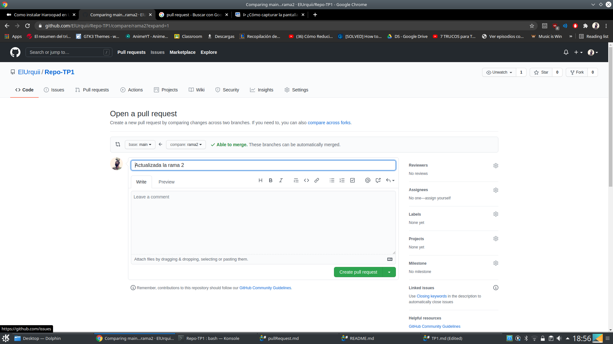
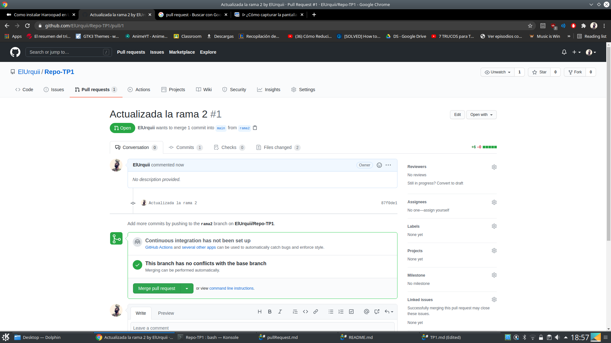
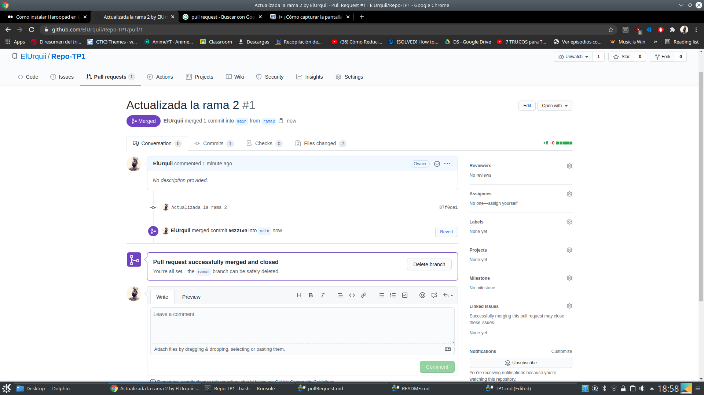
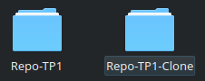
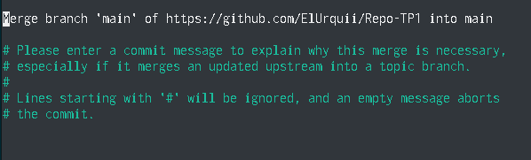
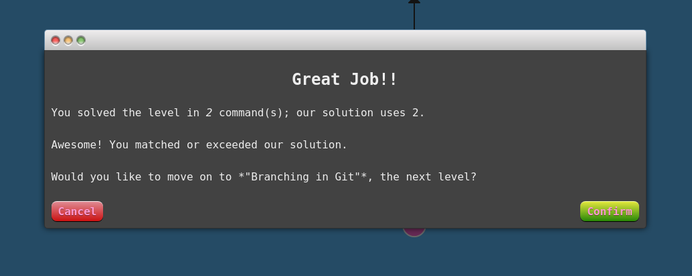
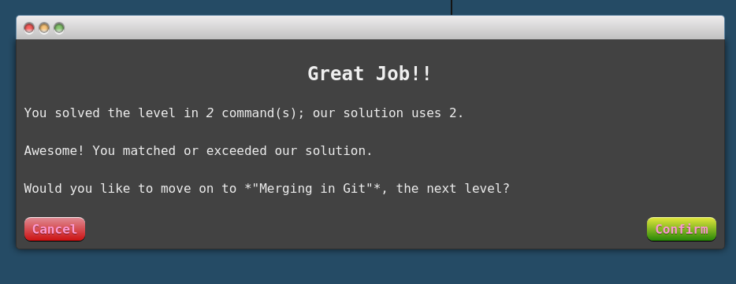
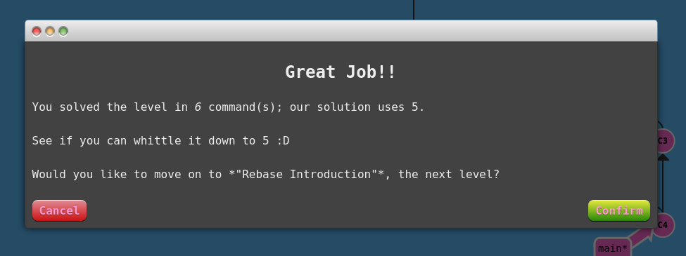
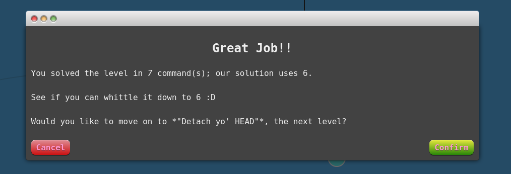

Trabajo N°1
========================

## 1)

```
sudo apt install git
0 upgraded, 0 newly installed, 0 to remove and 67 not upgraded.

git --version
git version 2.17.1
```

## 2)

```
git init
Initialized empty Git repository in /home/maximo/.git/

cd /home/maximo/.git/

touch README.md
touch CV.md
```

## 3)

```
git remote add origin https://github.com/ElUrquii/Repo-TP1.git
git branch -M main
git push -u origin main
```

## 4)

```
git checkout -b rama2

touch pullRequest.md

git add .
git commit -m "Actualizada la rama 2"
git push origin rama2
```




## 5)

```
git clone https://github.com/ElUrquii/Repo-TP1.git Repo-TP1-Clone
```

```
git add .
git commit -m "Cambios en CV.md"
git push origin main

git add .
git commit -m "Cambios en el CV.md del clon 2"
git push origin master

Username for 'https://github.com': ElUrquii
Password for 'https://ElUrquii@github.com': 
To https://github.com/ElUrquii/Repo-TP1.git
 ! [rejected]        main -> main (fetch first)
error: failed to push some refs to 'https://github.com/ElUrquii/Repo-TP1.git'
hint: Updates were rejected because the remote contains work that you do
hint: not have locally. This is usually caused by another repository pushing
hint: to the same ref. You may want to first integrate the remote changes
hint: (e.g., 'git pull ...') before pushing again.
hint: See the 'Note about fast-forwards' in 'git push --help' for details.

git pull
```


* **LOCAL** the "ours" side of the conflict - ie, your branch (HEAD) that will contain the results of the merge
* **BASE** the common ancestor. useful for feeding into a three-way merge tool
* **REMOTE** the "theirs" side of the conflict - the branch you are merging into HEAD

```
git push origin master
```

## 6)





